# Configurare e gestire le origini di IA per la gestione dei contenuti

Questa guida illustra come configurare le origini di IA per la gestione dei contenuti in Cloud Manager, dal rispetto dei prerequisiti alla creazione di un’origine di contenuto, confermando che è indicizzata e disponibile.

## Prerequisiti {#prerequisites}

Prima di iniziare, verifichi che siano soddisfatte le seguenti condizioni:

* Hai un programma Cloud Manager attivo con almeno un ambiente AEM as a Cloud Service.
* Hai il ruolo di **[Amministratore di sistema](https://experienceleague.adobe.com/en/docs/support-resources/adobe-support-tools-guide/adobe-admin-console/admin-roles)** in Admin Console per il programma.
* È stato eseguito il provisioning del profilo di prodotto dell&#39;ambiente in **Adobe Admin Console**. Vedere [Configurare un progetto Adobe Developer Console](setup-adc-project.md).

## Passaggio 1: aprire la scheda di configurazione IA per la gestione dei contenuti {#open-tab}

1. Accedi a [Cloud Manager](https://my.cloudmanager.adobe.com/) e seleziona il tuo programma.

   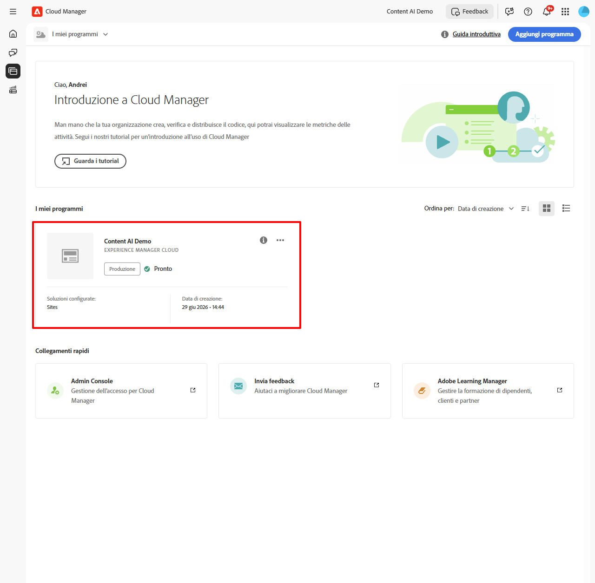

1. Dalla **[!UICONTROL Panoramica del programma]**, individua la sezione **[!UICONTROL Ambienti]** e seleziona l&#39;ambiente da configurare.

   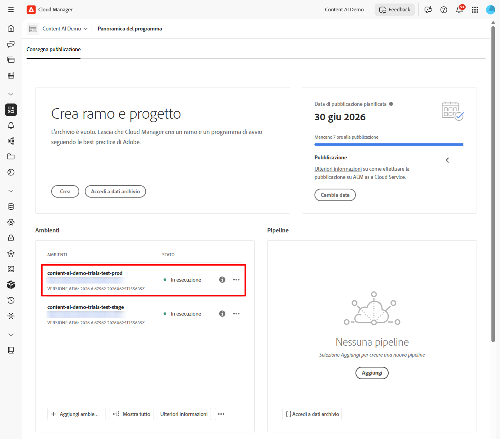

1. Nella pagina dei dettagli dell&#39;ambiente selezionare la scheda **[!UICONTROL Configurazione IA per la gestione dei contenuti]**.

   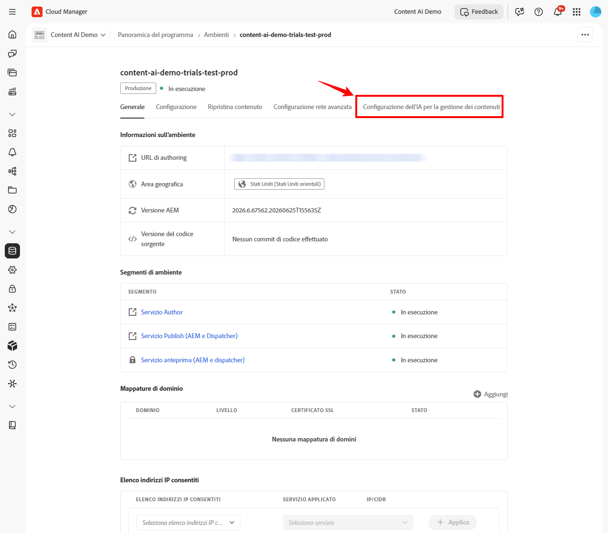

## Passaggio 2: creare un Source di IA per la gestione dei contenuti {#create-source}

Un’origine di contenuto definisce il sito web scansionato e indicizzato da IA per la gestione dei contenuti.

1. Nella scheda **[!UICONTROL Configurazione IA per la gestione dei contenuti]** selezionare **[!UICONTROL Crea Source]**.

   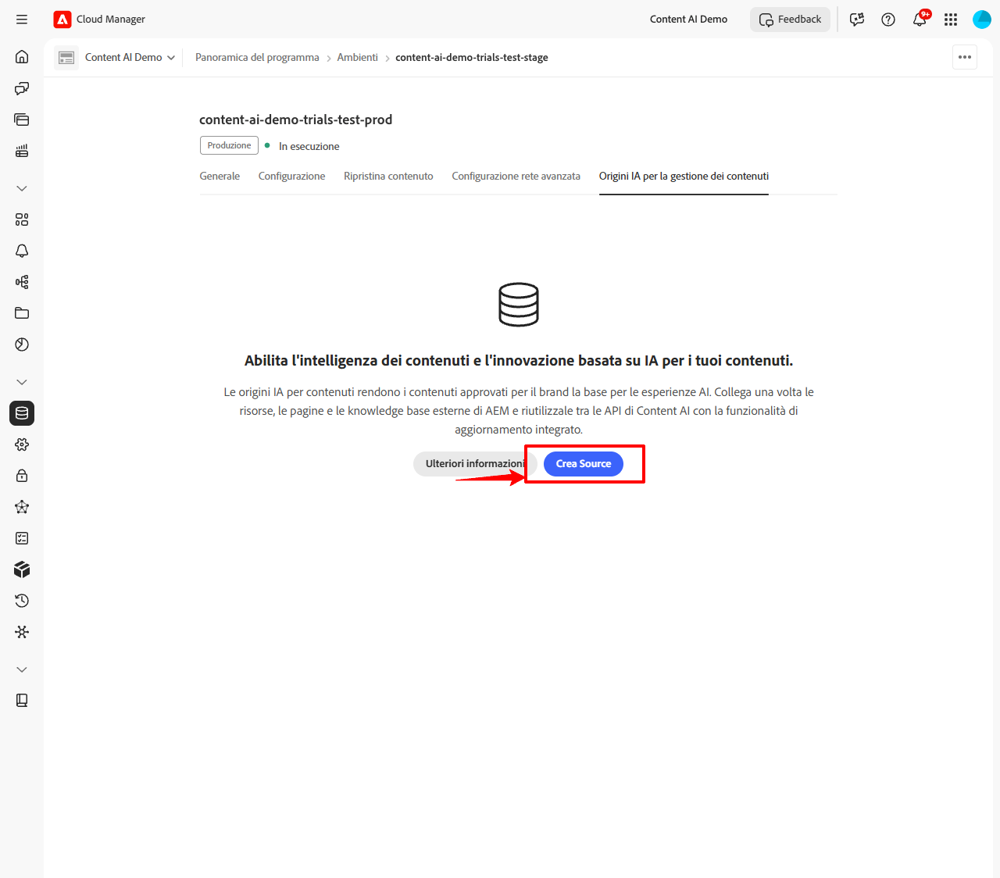

1. Nella finestra di dialogo **[!UICONTROL Crea/Aggiungi nuovo Source di IA per la gestione dei contenuti]**, compila i campi:

   | Campo | Descrizione |
   | --- | --- |
   | **[!UICONTROL Nome configurazione IA per la gestione dei contenuti]** | Un identificatore univoco per questa origine (ad esempio, `my-site-index`). Non può essere modificato dopo la creazione. |
   | **[!UICONTROL Descrizione]** | *(Facoltativo)* Breve descrizione dell&#39;origine di contenuto. |
   | **[!UICONTROL Indirizzo sito Web]** | URL principale del sito Web da scansionare (ad esempio, `https://www.example.com/`). |
   | **[!UICONTROL Escludi URL]** | *(Facoltativo)* pattern di URL da saltare durante la scansiona. |
   | **[!UICONTROL Frequenza di aggiornamento]** | Con quale frequenza la funzione IA per l’analisi dei contenuti scansiona nuovamente la sorgente: settimanale, giornaliera, giornaliera 4×, 60 min o 15 min. |

   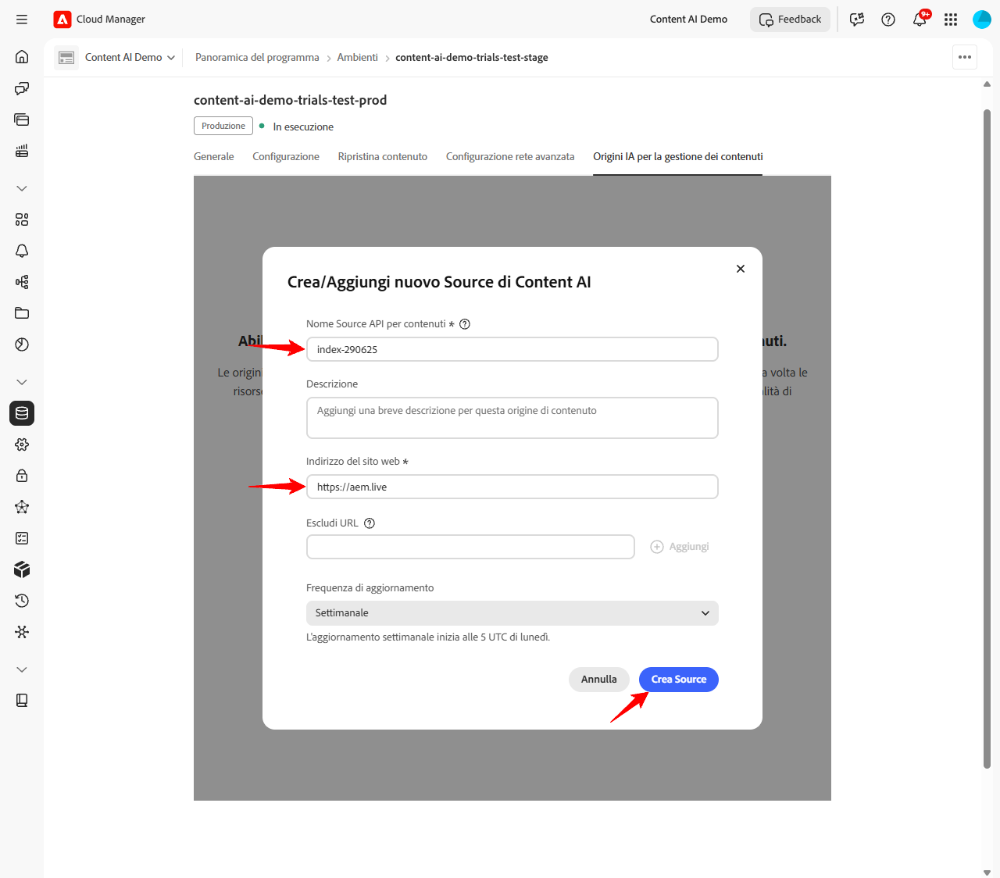

   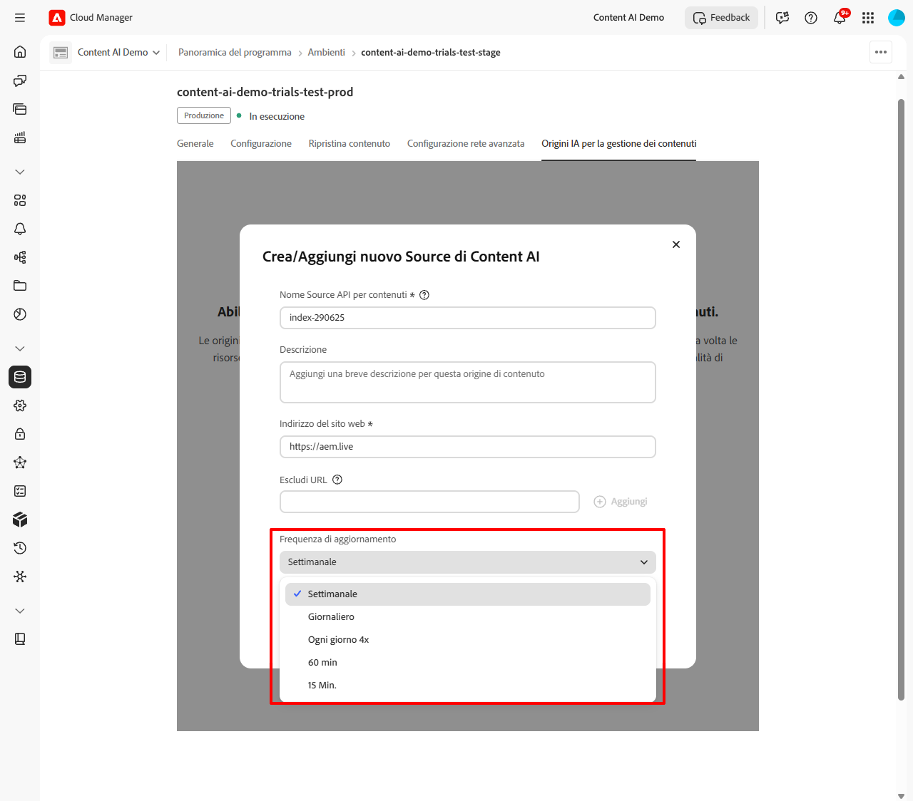

1. Selezionare **[!UICONTROL Crea Source]**.

## Passaggio 3: attivare l’acquisizione {#trigger-acquisition}

Dopo la creazione dell&#39;origine, lo stato è **Nuovo**. Esegui un&#39;acquisizione iniziale per avviare l&#39;indicizzazione.

1. Nell&#39;elenco di origine, seleziona l&#39;icona **altre azioni** (...) accanto all&#39;origine, quindi seleziona **[!UICONTROL Attiva acquisizione]**.

   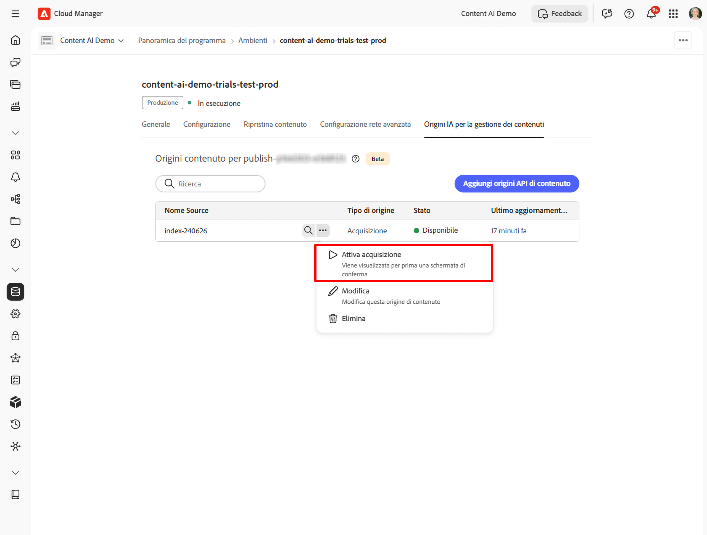

1. Nella finestra di dialogo **[!UICONTROL Trigger acquisizione]**, controlla i dettagli dell&#39;origine - **[!UICONTROL Origine contenuto]**, **[!UICONTROL Ultima esecuzione]** e **[!UICONTROL Prossima esecuzione pianificata]** - e seleziona **[!UICONTROL Trigger]**.

   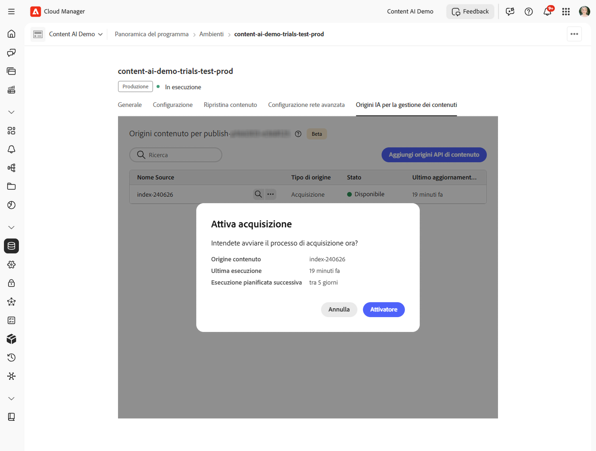

## Passaggio 4: monitorare lo stato dell’indicizzazione {#monitor-status}

Dopo l’avvio dell’acquisizione, lo stato dell’origine viene aggiornato in tempo reale.

| Stato | Significato |
| --- | --- |
| **Nuovo** | Source creato; non è ancora stata eseguita alcuna acquisizione. |
| **Indicizzazione** | Acquisizione in corso; il contenuto viene scansionato e indicizzato. |
| **Disponibile** | Indicizzazione completata. L’origine è pronta per elaborare le query di ricerca. |

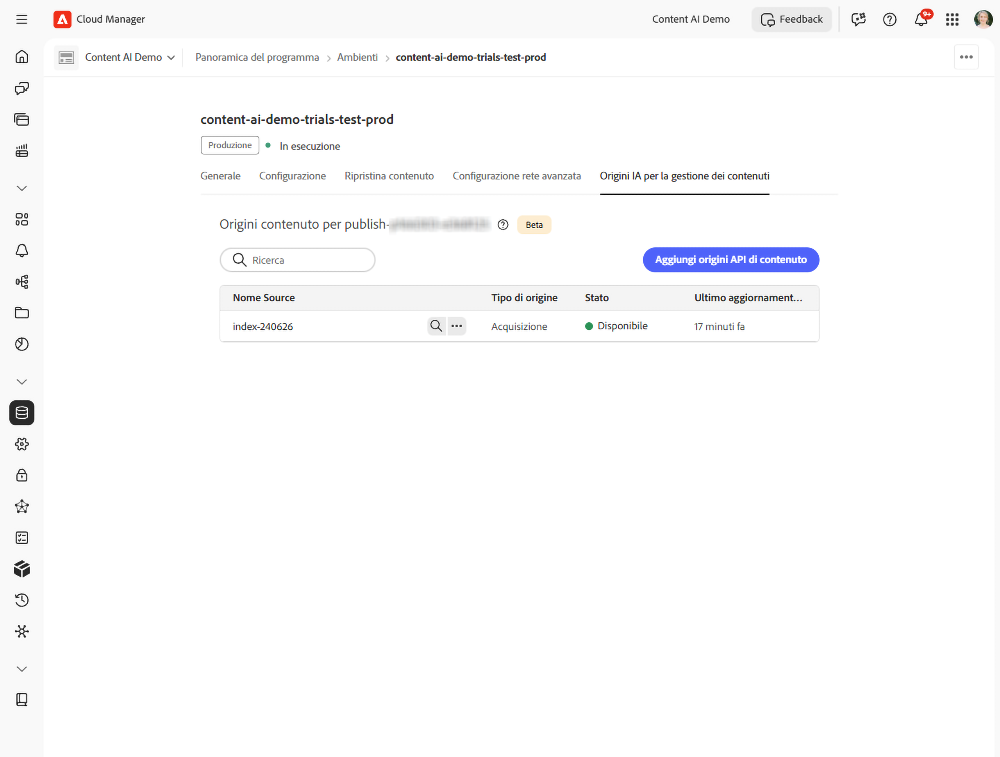

Attendi che lo stato raggiunga **Disponibile** prima di cercare nell&#39;indice o testare l&#39;API.

## Passaggio 5: cercare contenuti indicizzati {#search-content}

Una volta che lo stato dell&#39;origine è **Disponibile**, è possibile eseguire query di ricerca direttamente da Cloud Manager per verificare che il contenuto sia stato indicizzato correttamente.

1. Nell&#39;elenco delle origini, seleziona **[!UICONTROL Cerca]** accanto all&#39;origine.

   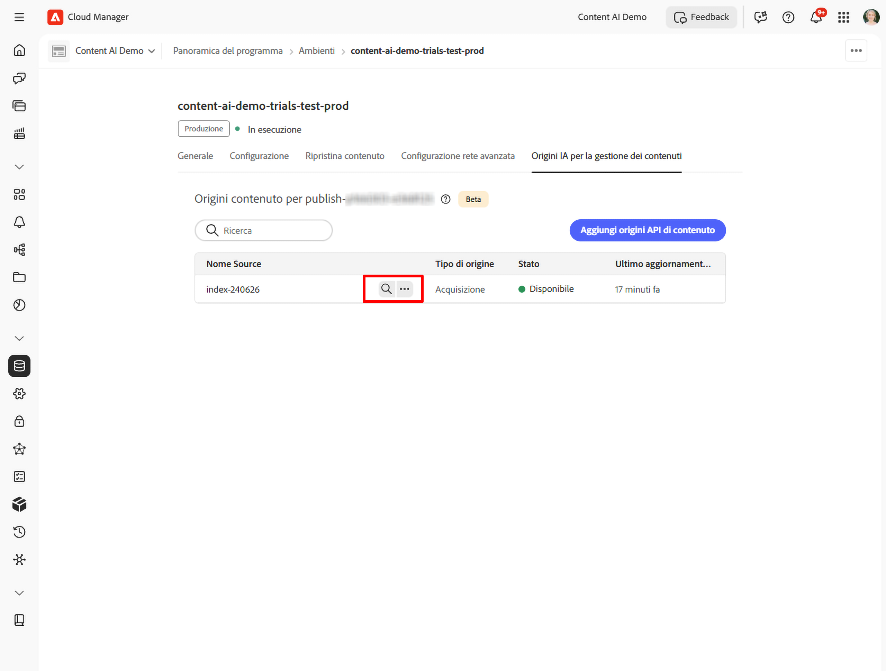

1. Immettere una query nel campo di ricerca. I risultati mostrano un elenco di elementi corrispondenti con un punteggio di corrispondenza e un tipo di contenuto (ad esempio, **PAGINA** o **PDF**). Selezionando un risultato si apre un&#39;anteprima a destra.

   

## Modificare o eliminare un Source {#modify-source}

Per aggiornare una configurazione di origine dopo che è stata creata:

1. Nell&#39;elenco di origine, selezionare l&#39;icona **altre azioni** (...) accanto all&#39;origine, quindi selezionare **[!UICONTROL Modifica]**.

   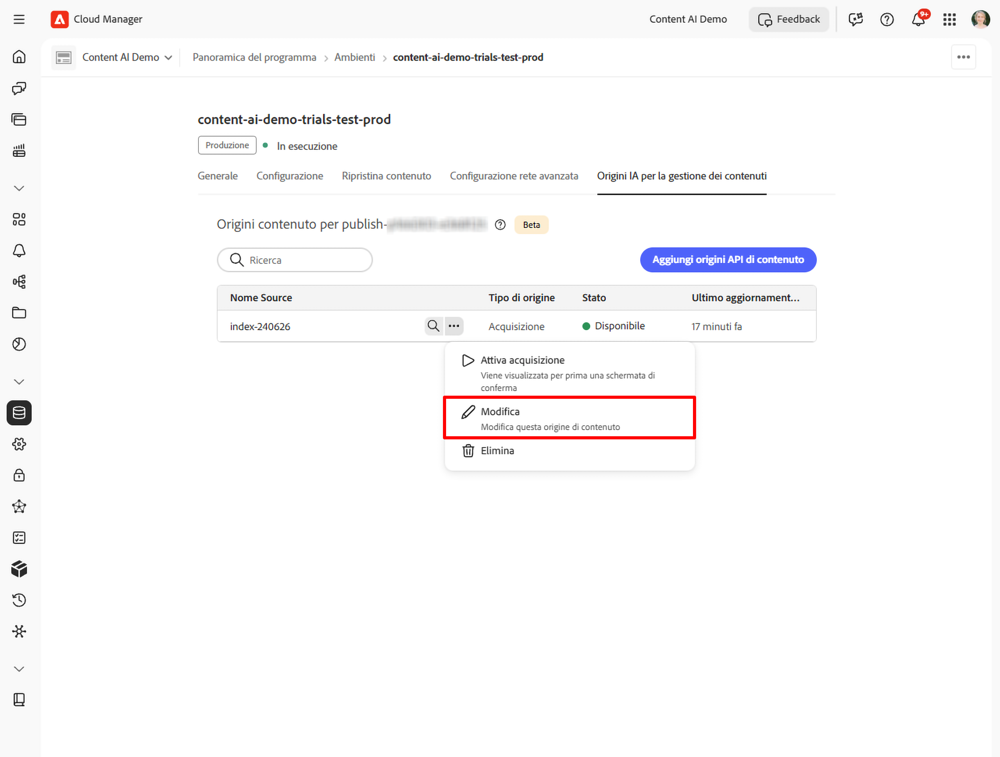

1. Nella finestra di dialogo **[!UICONTROL Modifica Source di IA per la gestione dei contenuti]**, aggiorna **[!UICONTROL Descrizione]**, **[!UICONTROL Indirizzo sito Web]**, **[!UICONTROL Escludi URL]** o **[!UICONTROL Frequenza di aggiornamento]** in base alle esigenze. Il nome di configurazione di **[!UICONTROL IA per la gestione dei contenuti]** è di sola lettura e non può essere modificato.

1. Seleziona **[!UICONTROL Salva]** per applicare le modifiche, oppure seleziona **[!UICONTROL Elimina]** nella parte inferiore sinistra della finestra di dialogo per rimuovere completamente l&#39;origine.

   >[!WARNING]
   >
   >L’eliminazione di un’origine è permanente. Tutto il contenuto indicizzato per tale origine viene rimosso e non può più essere utilizzato per le query di ricerca.

   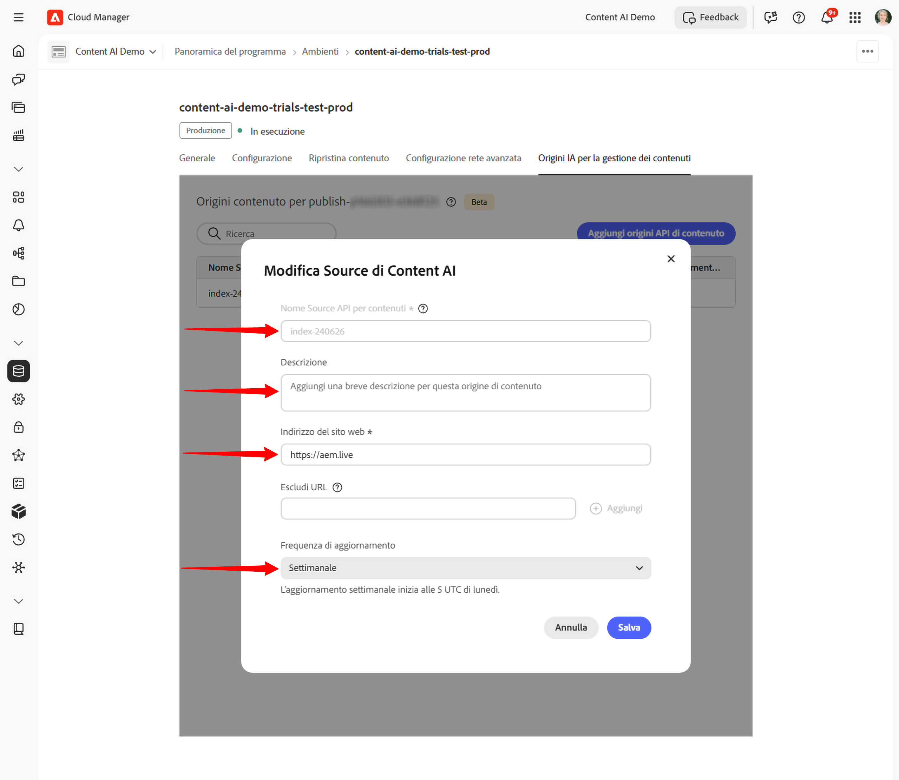

L’elenco delle sorgenti viene aggiornato in base alle modifiche apportate. Se hai eliminato l’origine, questa non viene più visualizzata nell’elenco.

## Passaggi successivi {#next-steps}

* [Configura un progetto Adobe Developer Console](setup-adc-project.md) - Crea il progetto ADC e le credenziali necessarie per chiamare l&#39;API.
* [Riferimento API IA per la gestione dei contenuti](https://developer.adobe.com/experience-cloud/experience-manager-apis/api/experimental/contentai/) - Eseguire una query sul contenuto indicizzato utilizzando endpoint di ricerca semantici, full-text o ibridi.

## Risoluzione di problemi {#troubleshooting}

* **Source rimane in [!UICONTROL Indicizzazione] per un periodo prolungato.** Riprova l’acquisizione dal menu (...). Se lo stato non avanza dopo una seconda esecuzione, verifica che l&#39;**[!UICONTROL indirizzo del sito Web]** sia raggiungibile pubblicamente e che i **[!UICONTROL modelli Escludi URL]** non filtrino ogni pagina.
* **Source torna a [!UICONTROL New] dopo un&#39;esecuzione.** Il crawler non è riuscito a recuperare alcuna pagina dall&#39;URL principale configurato. Verificare che l&#39;URL risponda con `200 OK` e che il sito non stia bloccando le richieste automatizzate.
* **[!UICONTROL La ricerca] non restituisce alcun risultato per un&#39;origine [!UICONTROL Disponibile].** Indicizzazione riuscita, ma nessun contenuto corrisponde alla query. Prova con una query più ampia o controlla che gli URL scansionati includano le pagine previste.
