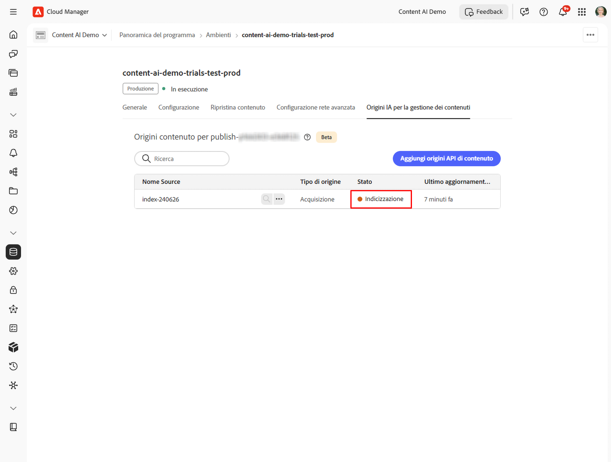

# Configurare e gestire le origini dell’IA per la gestione dei contenuti

Questa guida illustra come configurare le origini dell’IA per la gestione dei contenuti in Cloud Manager, dal rispetto dei prerequisiti alla creazione di un’origine di contenuto, fino alla conferma che sia indicizzata e disponibile.

## Prerequisiti {#prerequisites}

Prima di iniziare, verifica che siano soddisfatte le seguenti condizioni:

* Disponi di un programma Cloud Manager attivo con almeno un ambiente AEM as a Cloud Service.
* L&#39;utente è assegnato al profilo di prodotto **Utenti AEM** per l&#39;ambiente di destinazione, che consente all&#39;utente di visualizzare le origini di contenuto.
* L&#39;utente è assegnato al profilo di prodotto **Amministratori AEM** per l&#39;ambiente di destinazione, che consente all&#39;utente di creare e modificare origini di contenuto. L&#39;accesso a Cloud Manager da solo non è sufficiente. Vedere [Assegnare un utente a un profilo di prodotto AEM](#assign-product-profile).
* È stato eseguito il provisioning del profilo di prodotto dell&#39;ambiente in **Adobe Admin Console**.

## Assegnare un utente a un profilo di prodotto AEM {#assign-product-profile}

Utilizzare questa procedura per concedere a un utente l&#39;accesso a [!DNL Adobe Experience Manager] as a Cloud Service per un ambiente specifico. Assegna il profilo corrispondente all’accesso richiesto dall’utente:

* **[!UICONTROL Utenti AEM]** - visualizza origini di contenuto.
* **[!UICONTROL Amministratori AEM]**: crea e modifica origini di contenuto.

>[!NOTE]
>
>Gli utenti devono appartenere a un profilo di prodotto AEM, ad esempio **[!UICONTROL Utenti AEM]** o **[!UICONTROL Amministratori AEM]** per accedere ad AEM. L’accesso a Cloud Manager da solo non è sufficiente.

Per assegnare questi profili, devi essere un amministratore di sistema con il profilo di prodotto Cloud Manager [!UICONTROL Proprietario business]. Assicurati che il nome e l’indirizzo e-mail dell’utente siano pronti.

1. In [Cloud Manager](https://my.cloudmanager.adobe.com/), passa al programma e seleziona **[!UICONTROL Gestisci accesso]** per l&#39;ambiente di destinazione. Viene aperta una nuova scheda [!DNL Adobe Admin Console] per tale ambiente.
1. Seleziona il profilo di prodotto **[!UICONTROL Utenti AEM]** o **[!UICONTROL Amministratori AEM]** per il livello **publish**, ad esempio `AEM Administrators - publish - Program 12345 - Environment 67890`. IA per la gestione dei contenuti indicizza i contenuti pubblicati, pertanto il profilo deve essere assegnato a livello di pubblicazione, non di authoring.
1. Selezionare **[!UICONTROL Aggiungi utente]**.
1. Inserisci il nome e l’indirizzo e-mail dell’utente, quindi salva la modifica. L’utente viene aggiunto al profilo di prodotto.

Ripeti questi passaggi per ogni ambiente a cui l’utente deve accedere, ad esempio sviluppo, staging o produzione.

>[!CAUTION]
>
>Non modificare o eliminare i profili di prodotto predefiniti denominati **[!UICONTROL Amministratori AEM]** o **[!UICONTROL Utenti AEM]**. La ridenominazione di **[!UICONTROL Amministratori AEM]** comporta la rimozione dei diritti di amministratore da tutti gli utenti a esso assegnati.

### Verifica l’assegnazione {#verify-assignment}

Per verificare che l&#39;assegnazione sia riuscita:

1. In [!DNL Admin Console], riapri il profilo di prodotto assegnato.
1. Verificare che l&#39;utente sia visualizzato nell&#39;elenco dei membri.

Se stai cercando di risolvere i problemi di accesso o token, verifica che l’utente sia aggiunto direttamente al profilo di prodotto e non solo tramite un gruppo.

## Passaggio 1: apri la scheda di configurazione dell’IA per la gestione dei contenuti {#open-tab}

1. Accedi a [Cloud Manager](https://my.cloudmanager.adobe.com/) e seleziona il tuo programma.

   

1. In **[!UICONTROL Panoramica del programma]**, individua la sezione **[!UICONTROL Ambienti]** e seleziona l’ambiente da configurare.

   

1. Nella pagina dei dettagli dell’ambiente seleziona la scheda **[!UICONTROL Configurazione dell’IA per la gestione dei contenuti]**.

   

## Passaggio 2: creare un’origine dell’IA per la gestione dei contenuti {#create-source}

Un’origine del contenuto definisce il sito web scansionato e indicizzato dall’IA per la gestione dei contenuti.

1. Nella scheda **[!UICONTROL Configurazione dell’IA per la gestione dei contenuti]** seleziona **[!UICONTROL Crea origine]**.

   

1. Nella finestra di dialogo **[!UICONTROL Crea/aggiungi nuova origine dell’IA per la gestione dei contenuti]** compila i campi:

   | Campo | Descrizione |
   | --- | --- |
   | **[!UICONTROL Nome della configurazione dell’IA per la gestione dei contenuti]** | Identificatore univoco per questa origine (ad esempio `my-site-index`). Non modificabile dopo la creazione. |
   | **[!UICONTROL Descrizione]** | *(Facoltativo)* Breve descrizione dell’origine del contenuto. |
   | **[!UICONTROL Indirizzo del sito web]** | URL principale del sito web da scansionare (ad esempio `https://www.example.com/`). |
   | **[!UICONTROL Escludi URL]** | *(Facoltativo)* Pattern di URL da saltare durante la scansione. |
   | **[!UICONTROL Frequenza di aggiornamento]** | Frequenza con cui l’IA per la gestione dei contenuti scansiona nuovamente l’origine: settimanale, giornaliera, 4 a volte al giorno, ogni 60 o 15 min. |

   

   

1. Seleziona **[!UICONTROL Crea origine]**. L&#39;acquisizione viene avviata automaticamente e l&#39;origine viene spostata in **Indicizzazione**.

   

## Passaggio 3: rieseguire l’acquisizione {#trigger-acquisition}

L&#39;acquisizione viene eseguita automaticamente quando si crea un&#39;origine e quindi secondo la pianificazione impostata dalla **[!UICONTROL frequenza di aggiornamento]**. Puoi anche attivare manualmente un’esecuzione in qualsiasi momento, ad esempio per reindicizzare immediatamente dopo la pubblicazione di nuovo contenuto.

1. Nell’elenco di origine, seleziona l’icona per **altre azioni** (...) accanto all’origine, quindi **[!UICONTROL Attiva acquisizione]**.

   

1. Nella finestra di dialogo **[!UICONTROL Attiva acquisizione]** rivedi i dettagli dell’origine, ovvero **[!UICONTROL Origine contenuto]**, **[!UICONTROL Ultima esecuzione]** e **[!UICONTROL Esecuzione pianificata successiva]**, e seleziona **[!UICONTROL Attiva]**.

   

## Passaggio 4: monitorare lo stato dell’indicizzazione {#monitor-status}

Dopo l’avvio dell’acquisizione, lo stato dell’origine viene aggiornato in tempo reale.

| Stato | Significato |
| --- | --- |
| **Nuova** | Source appena creato; l&#39;acquisizione automatica non è ancora iniziata. Questo stato è breve. |
| **Indicizzazione** | Acquisizione in corso; il contenuto viene scansionato e indicizzato. |
| **Disponibile** | Indicizzazione completata; l’origine è pronta per elaborare le query di ricerca. |

Attendi che lo stato diventi **Disponibile** prima di cercare nell’indice o testare l’API.

## Passaggio 5: cercare contenuti indicizzati {#search-content}

Una volta che lo stato dell’origine è **Disponibile**, è possibile eseguire query di ricerca direttamente da Cloud Manager per verificare che il contenuto sia stato indicizzato correttamente.

1. Nell&#39;elenco delle origini selezionare l&#39;icona **cerca** (lente di ingrandimento) accanto all&#39;origine.

   

1. Inserisci una query nel campo di ricerca. I risultati mostrano un elenco di elementi corrispondenti con un punteggio di corrispondenza e un tipo di contenuto (ad esempio **PAGINA** o **PDF**). Selezionando un risultato si apre un’anteprima a destra.

   

## Modificare o eliminare un’origine {#modify-source}

### Modificare un’origine {#modify}

Per aggiornare la configurazione di un’origine dopo che è stata creata:

1. Nell’elenco di origini, seleziona l’icona per **altre azioni** (...) accanto all’origine, quindi **[!UICONTROL Modifica]**.

   

1. Nella finestra di dialogo **[!UICONTROL Modifica origine dell’IA per la gestione dei contenuti]** aggiorna **[!UICONTROL Descrizione]**, **[!UICONTROL Indirizzo sito web]**, **[!UICONTROL Escludi URL]** o **[!UICONTROL Frequenza di aggiornamento]** in base alle esigenze. Il **[!UICONTROL Nome della configurazione dell’IA per la gestione dei contenuti]** è di sola lettura e non può essere modificato.

   

1. Seleziona **[!UICONTROL Salva]** per applicare le modifiche. L’elenco di origini viene aggiornato in base alle modifiche apportate.

### Eliminare un’origine {#delete}

1. Nell&#39;elenco di origine, seleziona l&#39;icona **altre azioni** (...) accanto all&#39;origine, quindi seleziona **[!UICONTROL Elimina]**.

   >[!WARNING]
   >
   >L’eliminazione di un’origine è permanente. Tutto il contenuto indicizzato per tale origine viene rimosso e non può più essere utilizzato per le query di ricerca.

Dopo l’eliminazione, l’origine non viene più visualizzata nell’elenco.

## Passaggi successivi {#next-steps}

* [Configura un progetto in Adobe Developer Console](setup-adc-project.md): crea il progetto ADC e le credenziali necessarie per chiamare l’API.
* [Riferimento all’API dell’IA per la gestione dei contenuti](https://developer.adobe.com/experience-cloud/experience-manager-apis/api/experimental/contentai/): esegui una query sul contenuto indicizzato utilizzando endpoint di ricerca semantica, full-text o ibrida.

## Risoluzione di problemi {#troubleshooting}

* **L’origine rimane nell’[!UICONTROL indicizzazione] per un periodo prolungato.** Riprova l’acquisizione dal menu (...). Se lo stato non cambia dopo un secondo tentativo, verifica che l’**[!UICONTROL indirizzo del sito web]** sia raggiungibile pubblicamente e che i pattern **[!UICONTROL Escludi URL]** non filtrino ogni pagina.
* **L’origine torna su [!UICONTROL Nuova] dopo un’esecuzione.** Il crawler non è riuscito a recuperare alcuna pagina dall’URL principale configurato. Verifica che l’URL risponda con `200 OK` e che il sito non stia bloccando le richieste automatizzate.
* **[!UICONTROL La ricerca] non restituisce alcun risultato per un’origine [!UICONTROL Disponibile].** Indicizzazione riuscita, ma nessun contenuto corrisponde alla query. Prova con una query più ampia o controlla che gli URL scansionati includano le pagine previste.
