# Configurare e gestire le origini dell’IA per la gestione dei contenuti

Questa guida illustra come configurare le origini dell’IA per la gestione dei contenuti in Cloud Manager, dal rispetto dei prerequisiti alla creazione di un’origine di contenuto, fino alla conferma che sia indicizzata e disponibile.

## Prerequisiti {#prerequisites}

Prima di iniziare, verifica che siano soddisfatte le seguenti condizioni:

* Disponi di un programma Cloud Manager attivo con almeno un ambiente AEM as a Cloud Service.
* Hai un profilo di prodotto Cloud Manager e puoi accedere a Cloud Manager. Vedi [Ottieni l&#39;accesso a Cloud Manager](#cloud-manager-access) di seguito.
* L’utente è assegnato al profilo di prodotto **Utenti AEM** per l’ambiente di destinazione, e può visualizzare le origini dei contenuti.
* L’utente è assegnato al profilo di prodotto **Amministratori AEM** per l’ambiente di destinazione, e può creare e modificare le origini dei contenuti. Il solo accesso a Cloud Manager non è sufficiente. Consulta [Assegnare un utente a un profilo di prodotto AEM](#assign-product-profile), di seguito.
* È stato eseguito il provisioning del profilo di prodotto dell’ambiente in **Adobe Admin Console**.

## Accedere a Cloud Manager {#cloud-manager-access}

Per aprire la scheda **[!UICONTROL Configurazione di IA per la gestione dei contenuti]**, è necessario accedere all&#39;interfaccia utente di Cloud Manager. L&#39;amministratore [!DNL Adobe Admin Console] dell&#39;organizzazione (amministratore di sistema o amministratore di prodotto) concede questo accesso.

1. Contatta l&#39;amministratore [[!DNL Adobe Admin Console]](https://adminconsole.adobe.com/). Se non sei ancora membro dell’organizzazione, chiedi all’amministratore di aggiungere il tuo indirizzo Adobe ID o e-mail.
1. Chiedi all’amministratore di assegnarti un profilo di prodotto Cloud Manager per il programma AEM as a Cloud Service dell’organizzazione:

   | Profilo di prodotto | Cosa consente |
   | --- | --- |
   | **[!UICONTROL Proprietario business]** | Gestisce i programmi. Dispone di ampie autorizzazioni Cloud Manager, tra cui **[!UICONTROL Gestisci accesso]**. |
   | **[!UICONTROL Responsabile della distribuzione]** | Gestisce ambienti, distribuzioni e pipeline. |
   | **[!UICONTROL Responsabile del programma]** | Gestisce la configurazione del team e la supervisione del programma. |
   | **[!UICONTROL Sviluppatore]** | Funziona con il codice e Git. Ha autorizzazioni Cloud Manager limitate. |

1. Per aprire Cloud Manager, accedi a [Cloud Manager](https://my.cloudmanager.adobe.com/) o passa a [[!DNL Adobe Experience Cloud]](https://experience.adobe.com/) > **[!DNL Experience Manager]** > **[!UICONTROL Cloud Manager]**. Se il tuo Adobe ID appartiene a più organizzazioni, seleziona quella corretta.

>[!NOTE]
>
>Un profilo di prodotto Cloud Manager non consente l’accesso alle origini di contenuto. È inoltre necessario il profilo di prodotto **[!UICONTROL Utenti AEM]** o **[!UICONTROL Amministratori AEM]** per l&#39;ambiente. Vedere [Assegnare un utente a un profilo di prodotto AEM](#assign-product-profile). Un utente con solo il ruolo utente predefinito di Cloud Manager può aprire un ambiente ma non ottenere l’accesso a livello di programma.

Se effettui l&#39;accesso ma non riesci a visualizzare il programma o la scheda **[!UICONTROL Configurazione di IA per la gestione dei contenuti]**, chiedi all&#39;amministratore di verificare i profili di prodotto assegnati. Conferma anche di aver selezionato l’organizzazione corretta al momento dell’accesso. AEM Managed Services utilizza un contesto e una configurazione del prodotto [!DNL Admin Console] diversi da quelli di AEM as a Cloud Service.

Per creare i programmi durante l&#39;onboarding iniziale, l&#39;amministratore di sistema deve innanzitutto disporre del profilo **[!UICONTROL Proprietario business]** e accedere a Cloud Manager.

Per ulteriori informazioni, consulta:

* [Assegnare membri del gruppo ai profili di prodotto di Cloud Manager](https://experienceleague.adobe.com/en/docs/experience-manager-cloud-service/content/onboarding/journey/assign-profiles-cloud-manager)
* [Accesso a Cloud Manager](https://experienceleague.adobe.com/it/docs/experience-manager-cloud-service/content/onboarding/journey/cloud-manager)
* [Team e profili di prodotto di AEM as a Cloud Service](https://experienceleague.adobe.com/en/docs/experience-manager-cloud-service/content/onboarding/concepts/aem-cs-team-product-profiles)
* [Aggiungere utenti e ruoli](https://experienceleague.adobe.com/en/docs/experience-manager-cloud-manager/content/requirements/users-and-roles)

## Assegnare un utente a un profilo di prodotto AEM {#assign-product-profile}

Utilizza questa procedura per concedere a un utente l’accesso a [!DNL Adobe Experience Manager] as a Cloud Service per un ambiente specifico. Assegna il profilo corrispondente all’accesso richiesto dall’utente:

* **[!UICONTROL Utenti AEM]**: visualizza le origini dei contenuti.
* **[!UICONTROL Amministratori AEM]**: crea e modifica le origini dei contenuti.

>[!NOTE]
>
>Gli utenti devono appartenere a un profilo di prodotto AEM, ad esempio **[!UICONTROL Utenti AEM]** o **[!UICONTROL Amministratori AEM]** per accedere ad AEM. Il solo accesso a Cloud Manager non è sufficiente.

Per assegnare questi profili, devi essere amministratore di sistema con il profilo di prodotto [!UICONTROL Proprietario business] di Cloud Manager. Assicurati di disporre del nome e dell’indirizzo e-mail dell’utente.

1. In [Cloud Manager](https://my.cloudmanager.adobe.com/), passa al programma e seleziona **[!UICONTROL Gestisci accesso]** per l’ambiente di destinazione. Viene aperta una nuova scheda [!DNL Adobe Admin Console] per tale ambiente.
1. Seleziona il profilo di prodotto **[!UICONTROL Utenti AEM]** o **[!UICONTROL Amministratori AEM]** per i livelli **Author** e **Publish**, ad esempio `AEM Administrators - author - Program 12345 - Environment 67890` e `AEM Administrators - publish - Program 12345 - Environment 67890`.
   * **[!UICONTROL Utenti AEM]** - operazioni di sola lettura.
   * **[!UICONTROL Amministratori AEM]**: operazioni di scrittura, ad esempio la creazione, la modifica o la rimozione di un&#39;origine di contenuto e l&#39;attivazione dell&#39;acquisizione.
1. Seleziona **[!UICONTROL Aggiungi utente]**.
1. Inserisci il nome e l’indirizzo e-mail dell’utente, quindi salva la modifica. L’utente viene aggiunto al profilo di prodotto.

Ripeti questi passaggi per ogni ambiente a cui l’utente deve accedere, ad esempio sviluppo, staging o produzione.

>[!CAUTION]
>
>Non modificare o eliminare i profili di prodotto denominati **[!UICONTROL Amministratori AEM]** o **[!UICONTROL Utenti AEM]**. La ridenominazione di **[!UICONTROL Amministratori AEM]** comporta la rimozione dei diritti di amministratore da tutti gli utenti a esso assegnati.

### Verificare l’assegnazione {#verify-assignment}

Per verificare che l’assegnazione sia riuscita:

1. In [!DNL Admin Console], riapri il profilo di prodotto assegnato.
1. Verifica che l’utente sia visualizzato nell’elenco dei membri.

Se stai cercando di risolvere i problemi di accesso o token, verifica che l’utente sia aggiunto direttamente al profilo di prodotto e non solo tramite un gruppo.

## Passaggio 1: apri la scheda di configurazione dell’IA per la gestione dei contenuti {#open-tab}

1. Accedi a [Cloud Manager](https://my.cloudmanager.adobe.com/) e seleziona il tuo programma.

   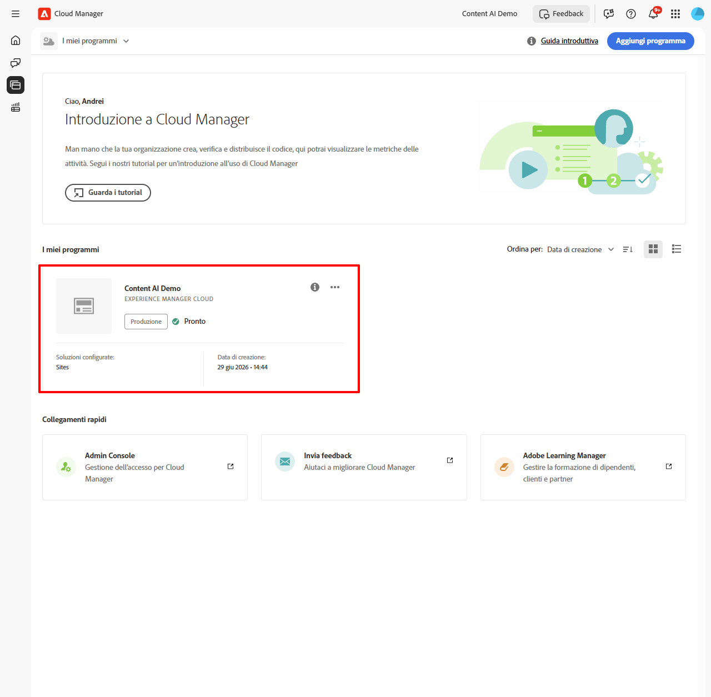

1. In **[!UICONTROL Panoramica del programma]**, individua la sezione **[!UICONTROL Ambienti]** e seleziona l’ambiente da configurare.

   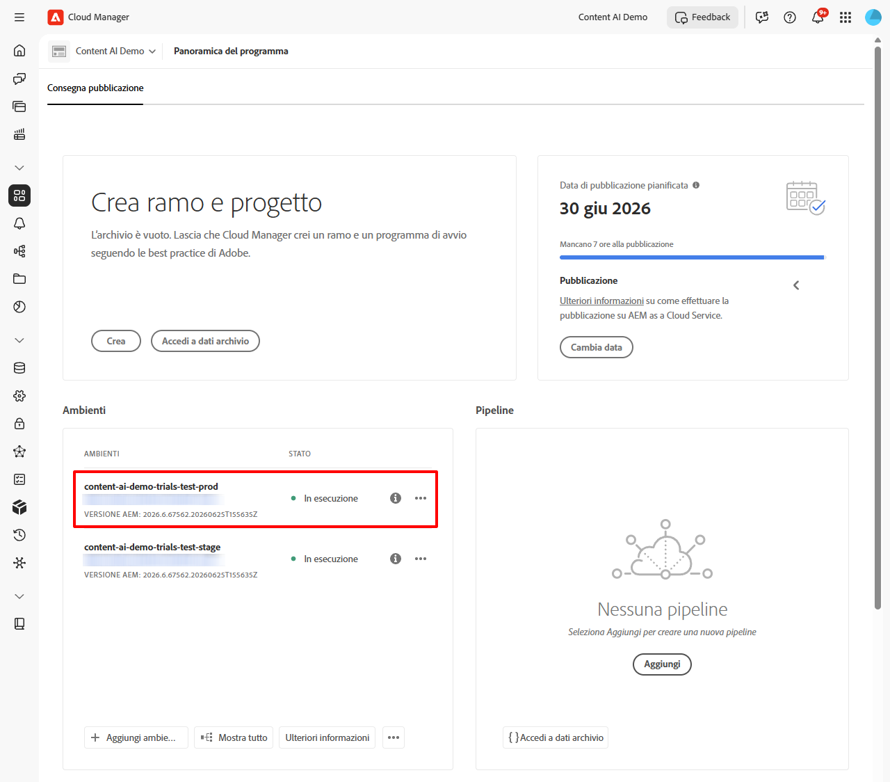

1. Nella pagina dei dettagli dell’ambiente seleziona la scheda **[!UICONTROL Configurazione dell’IA per la gestione dei contenuti]**.

   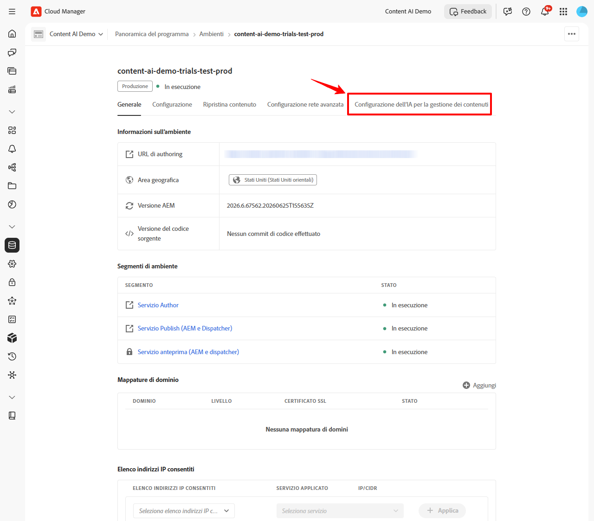

## Passaggio 2: creare un’origine dell’IA per la gestione dei contenuti {#create-source}

Un’origine del contenuto definisce il sito web scansionato e indicizzato dall’IA per la gestione dei contenuti.

1. Nella scheda **[!UICONTROL Configurazione dell’IA per la gestione dei contenuti]** seleziona **[!UICONTROL Crea origine]**.

   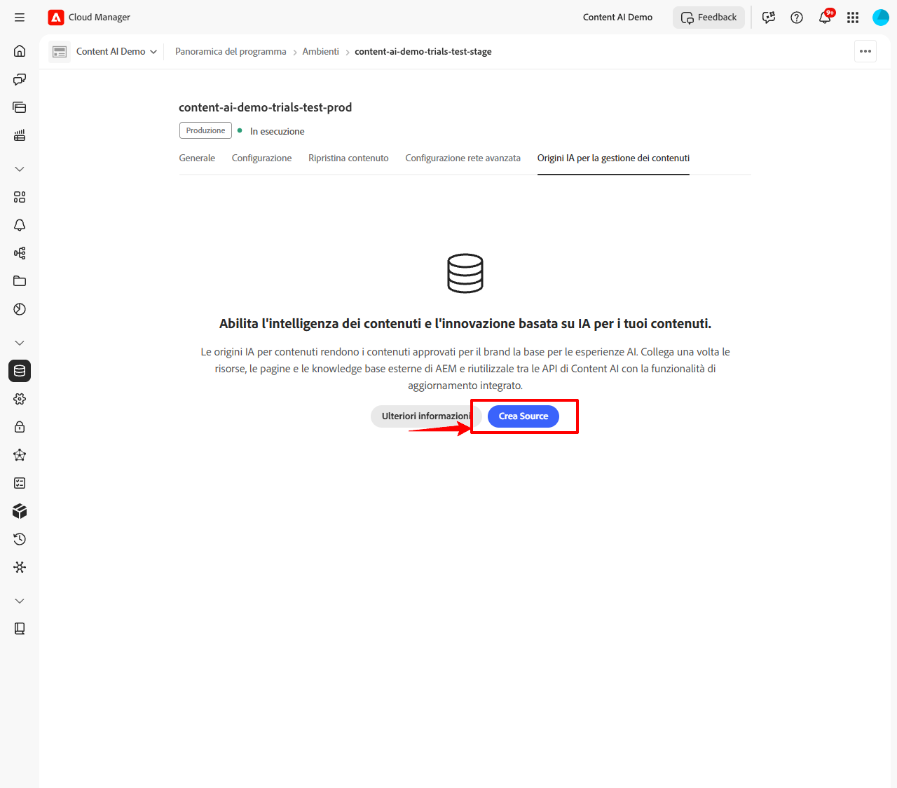

1. Nella finestra di dialogo **[!UICONTROL Crea/aggiungi nuova origine dell’IA per la gestione dei contenuti]** compila i campi:

   | Campo | Descrizione |
   | --- | --- |
   | **[!UICONTROL Nome della configurazione dell’IA per la gestione dei contenuti]** | Identificatore univoco per questa origine (ad esempio `my-site-index`). Non modificabile dopo la creazione. |
   | **[!UICONTROL Descrizione]** | *(Facoltativo)* Breve descrizione dell’origine del contenuto. |
   | **[!UICONTROL Indirizzo del sito web]** | URL principale del sito web da scansionare (ad esempio `https://www.example.com/`). |
   | **[!UICONTROL Escludi URL]** | *(Facoltativo)* Pattern di URL da saltare durante la scansione. |
   | **[!UICONTROL Frequenza di aggiornamento]** | Frequenza con cui l’IA per la gestione dei contenuti scansiona nuovamente l’origine: settimanale, giornaliera, 4 a volte al giorno, ogni 60 o 15 min. |

   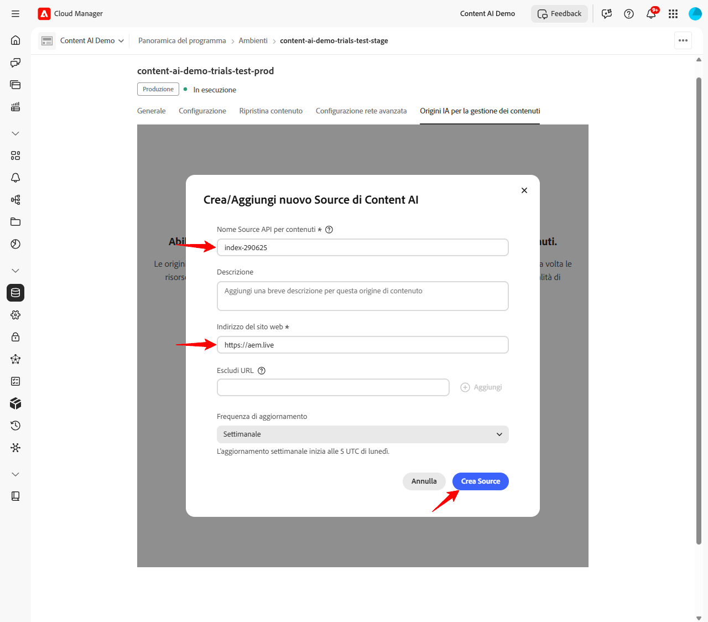

   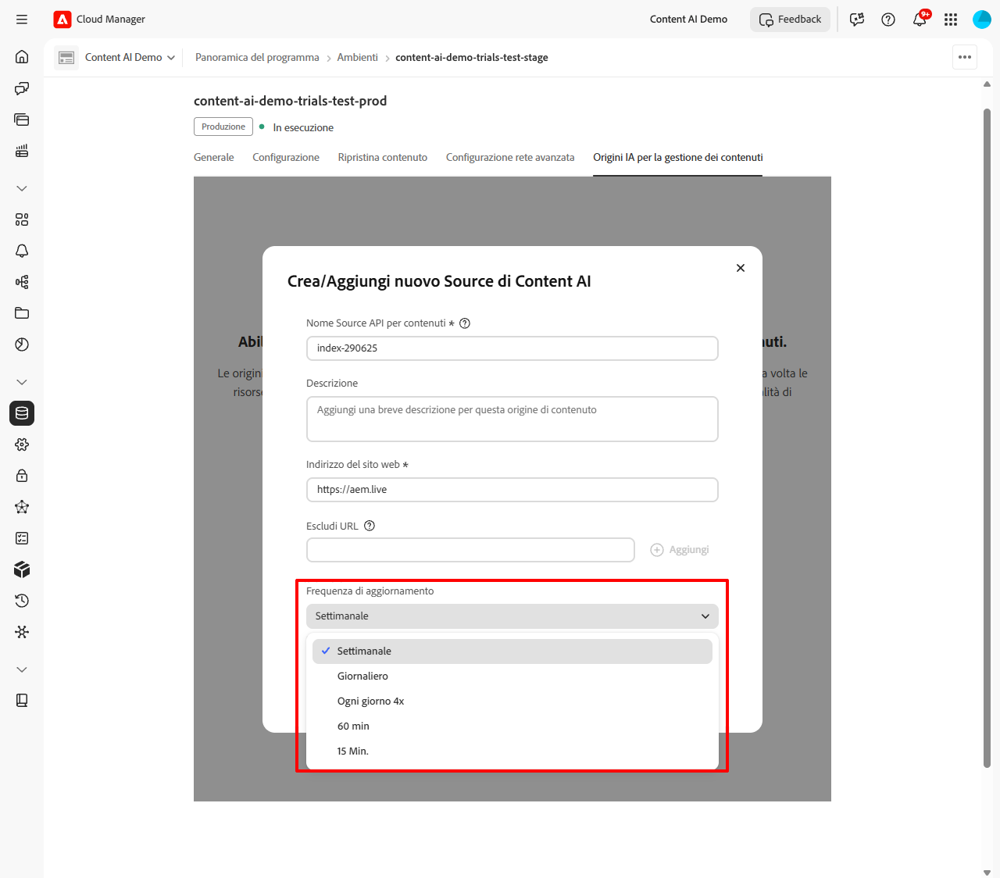

1. Seleziona **[!UICONTROL Crea origine]**. L’acquisizione viene avviata automaticamente e l’origine viene spostata in **Indicizzazione**.

   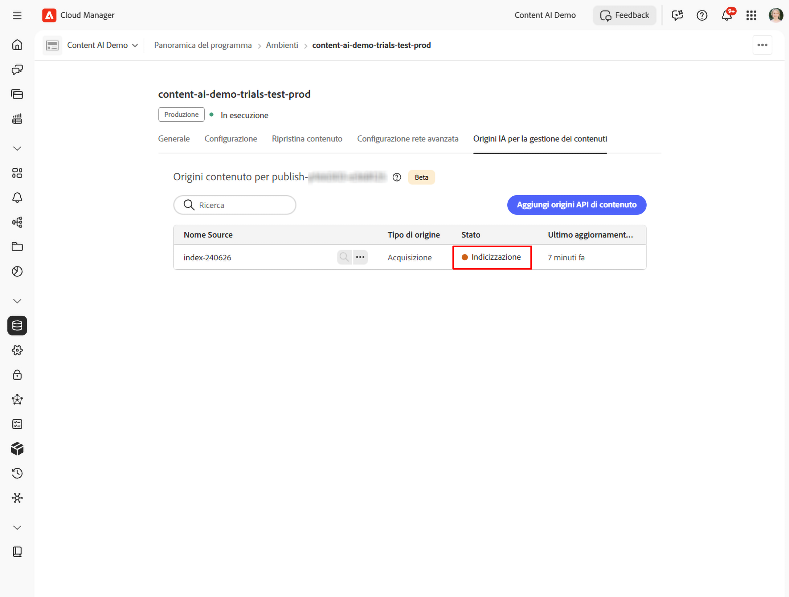

## Passaggio 3: eseguire di nuovo l’acquisizione {#trigger-acquisition}

L’acquisizione viene eseguita automaticamente quando crei un’origine e secondo la pianificazione impostata nella **[!UICONTROL frequenza di aggiornamento]**. Puoi anche attivare manualmente un’esecuzione in qualsiasi momento, ad esempio per reindicizzare immediatamente dopo la pubblicazione di nuovo contenuto.

1. Nell’elenco di origine, seleziona l’icona per **altre azioni** (...) accanto all’origine, quindi **[!UICONTROL Attiva acquisizione]**.

   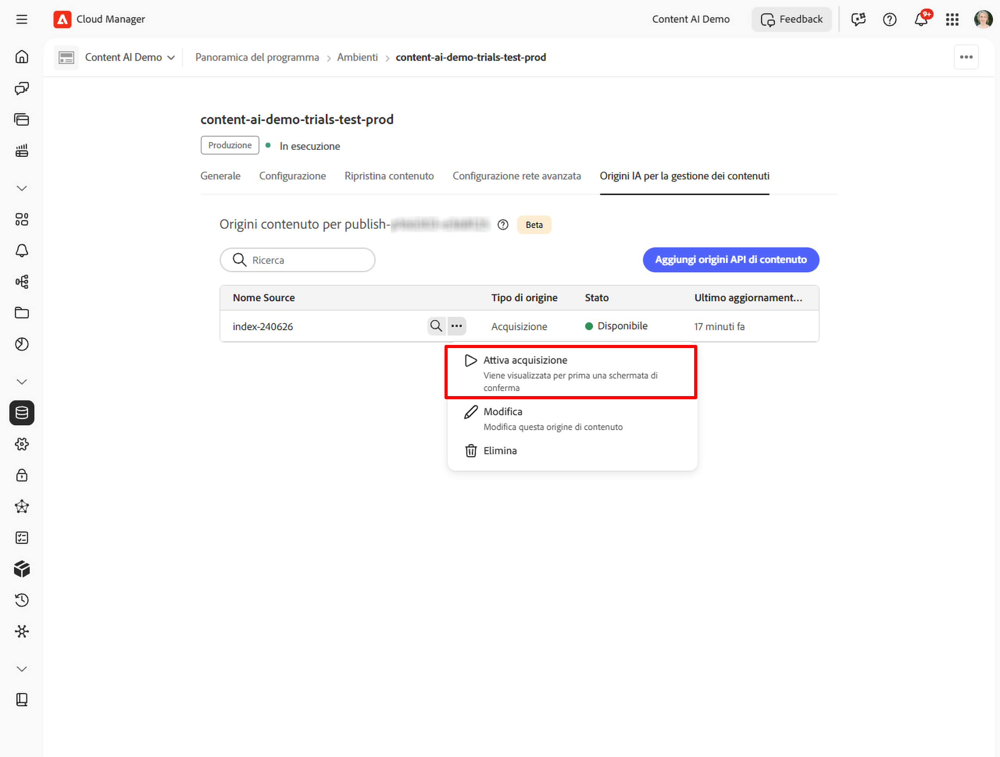

1. Nella finestra di dialogo **[!UICONTROL Attiva acquisizione]** rivedi i dettagli dell’origine, ovvero **[!UICONTROL Origine contenuto]**, **[!UICONTROL Ultima esecuzione]** e **[!UICONTROL Esecuzione pianificata successiva]**, e seleziona **[!UICONTROL Attiva]**.

   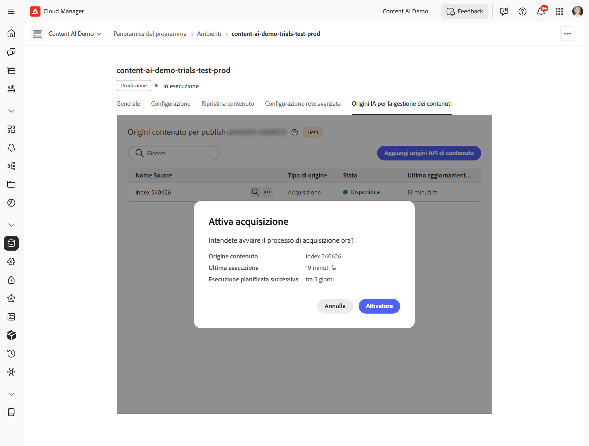

## Passaggio 4: monitorare lo stato dell’indicizzazione {#monitor-status}

Dopo l’avvio dell’acquisizione, lo stato dell’origine viene aggiornato in tempo reale.

| Stato | Significato |
| --- | --- |
| **Nuova** | Origine appena creata; l’acquisizione automatica non è ancora iniziata. Questo stato è temporaneo. |
| **Indicizzazione** | Acquisizione in corso; il contenuto viene scansionato e indicizzato. |
| **Disponibile** | Indicizzazione completata; l’origine è pronta per elaborare le query di ricerca. |

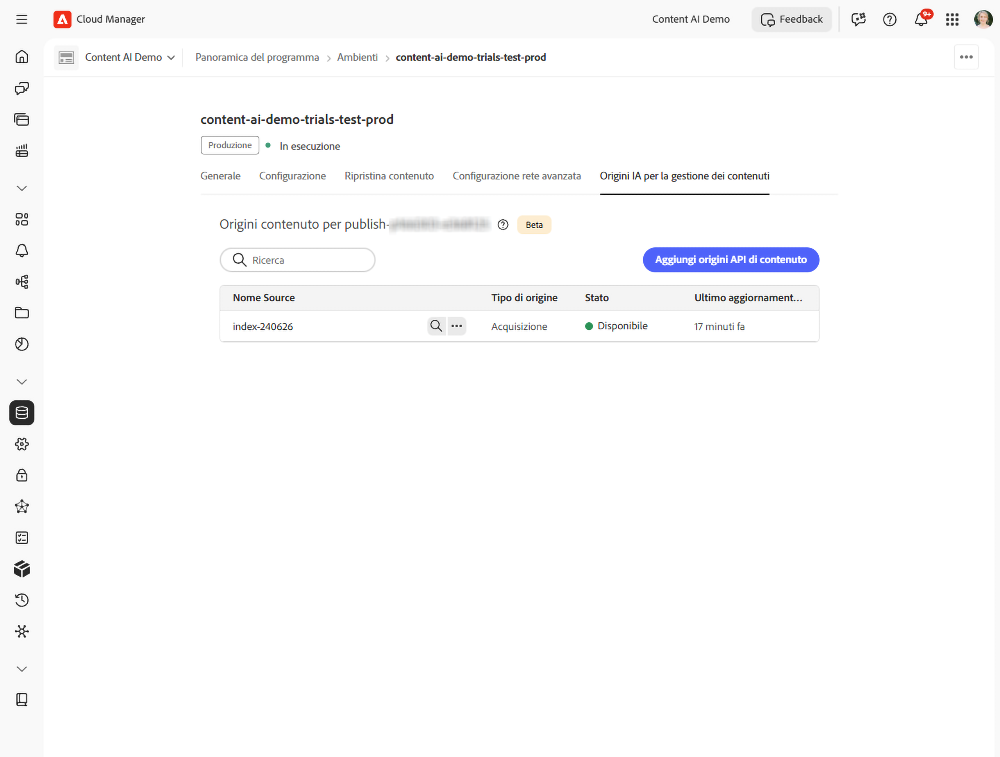

Attendi che lo stato diventi **Disponibile** prima di cercare nell’indice o testare l’API.

## Passaggio 5: cercare contenuti indicizzati {#search-content}

Una volta che lo stato dell’origine è **Disponibile**, è possibile eseguire query di ricerca direttamente da Cloud Manager per verificare che il contenuto sia stato indicizzato correttamente.

1. Nell’elenco delle origini, seleziona l’icona **Cerca** (lente di ingrandimento) accanto all’origine.

   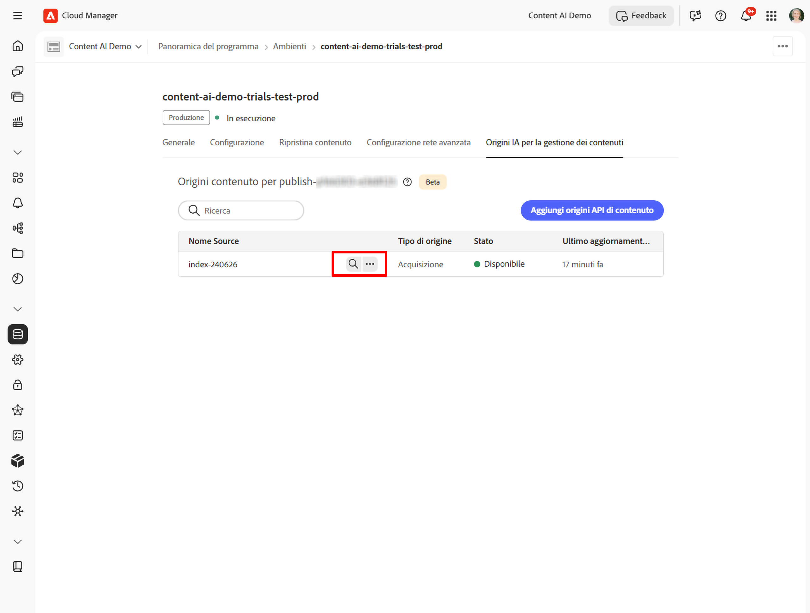

1. Inserisci una query nel campo di ricerca. I risultati mostrano un elenco di elementi corrispondenti con un punteggio di corrispondenza e un tipo di contenuto (ad esempio **PAGINA** o **PDF**). Selezionando un risultato si apre un’anteprima a destra.

   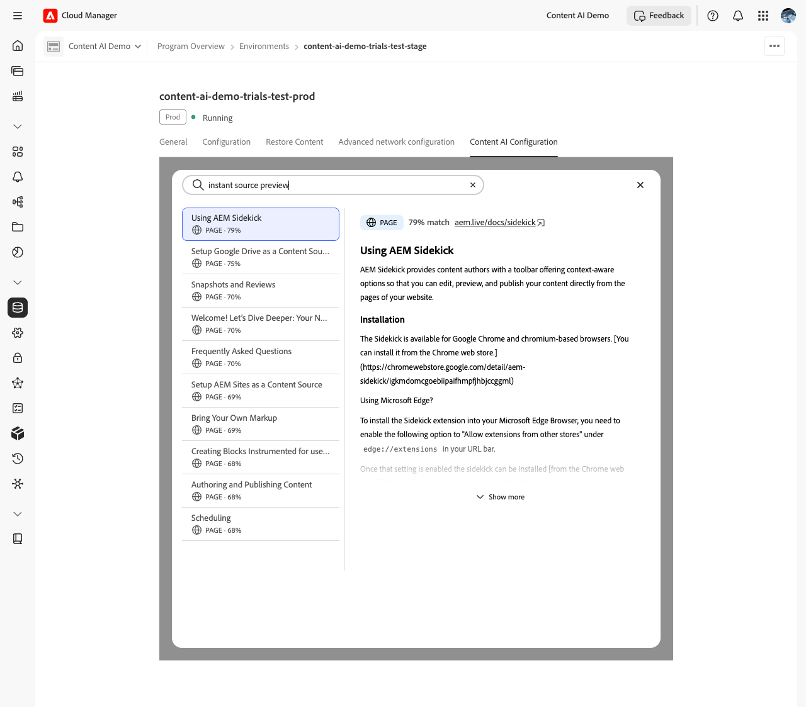

## Modificare o eliminare un’origine {#modify-source}

### Modificare un’origine {#modify}

Per aggiornare la configurazione di un’origine dopo che è stata creata:

1. Nell’elenco di origini, seleziona l’icona per **altre azioni** (...) accanto all’origine, quindi **[!UICONTROL Modifica]**.

   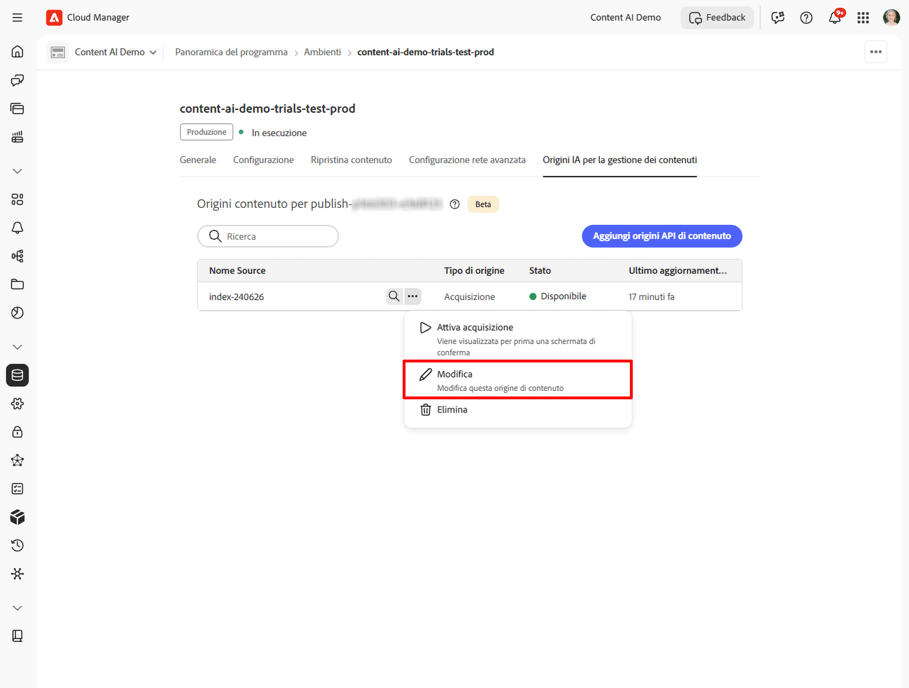

1. Nella finestra di dialogo **[!UICONTROL Modifica origine dell’IA per la gestione dei contenuti]** aggiorna **[!UICONTROL Descrizione]**, **[!UICONTROL Indirizzo sito web]**, **[!UICONTROL Escludi URL]** o **[!UICONTROL Frequenza di aggiornamento]** in base alle esigenze. Il **[!UICONTROL Nome della configurazione dell’IA per la gestione dei contenuti]** è di sola lettura e non può essere modificato.

   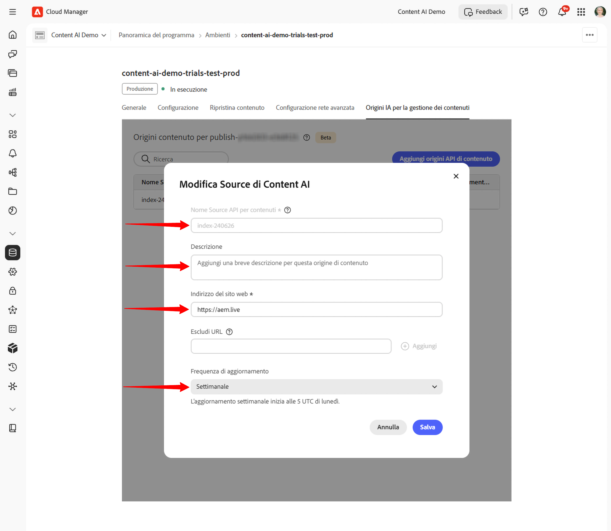

1. Seleziona **[!UICONTROL Salva]** per applicare le modifiche. L’elenco di origini viene aggiornato in base alle modifiche apportate.

### Eliminare un’origine {#delete}

1. Nell’elenco delle origini, seleziona l’icona **altre azioni** (...) accanto all’origine, quindi seleziona **[!UICONTROL Elimina]**.

   >[!WARNING]
   >
   >L’eliminazione di un’origine è permanente. Tutto il contenuto indicizzato per tale origine viene rimosso e non può più essere utilizzato per le query di ricerca.

Dopo l’eliminazione, l’origine non sarà più visualizzata nell’elenco.

## Passaggi successivi {#next-steps}

* [Configura un progetto in Adobe Developer Console](setup-adc-project.md): crea il progetto ADC e le credenziali necessarie per chiamare l’API.
* [Riferimento all’API dell’IA per la gestione dei contenuti](https://developer.adobe.com/experience-cloud/experience-manager-apis/api/experimental/contentai/): esegui una query sul contenuto indicizzato utilizzando endpoint di ricerca semantica, full-text o ibrida.

## Risoluzione di problemi {#troubleshooting}

* **L’origine rimane nell’[!UICONTROL indicizzazione] per un periodo prolungato.** Riprova l’acquisizione dal menu (...). Se lo stato non cambia dopo un secondo tentativo, verifica che l’**[!UICONTROL indirizzo del sito web]** sia raggiungibile pubblicamente e che i pattern **[!UICONTROL Escludi URL]** non filtrino ogni pagina.
* **L’origine torna su [!UICONTROL Nuova] dopo un’esecuzione.** Il crawler non è riuscito a recuperare alcuna pagina dall’URL principale configurato. Verifica che l’URL risponda con `200 OK` e che il sito non stia bloccando le richieste automatizzate.
* **[!UICONTROL La ricerca] non restituisce alcun risultato per un’origine [!UICONTROL Disponibile].** Indicizzazione riuscita, ma nessun contenuto corrisponde alla query. Prova con una query più ampia o controlla che gli URL scansionati includano le pagine previste.
