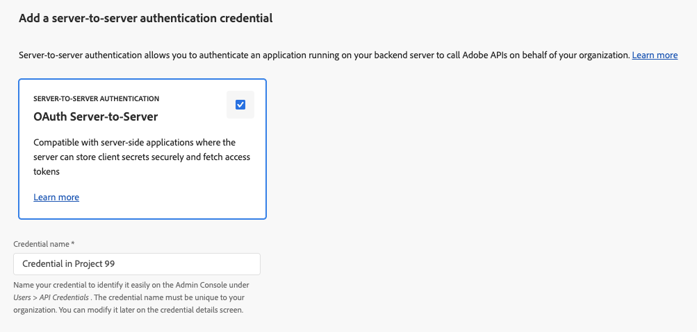
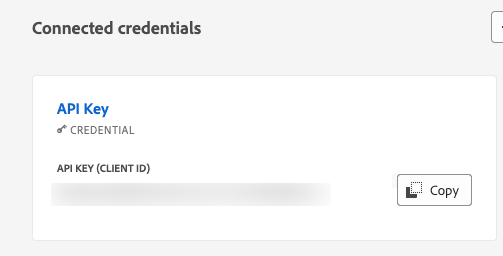

# Configurare un progetto in Adobe Developer Console {#configure-adc-project}

Per richiamare l’API AEM Content AI Services, è necessario disporre delle credenziali rilasciate da un progetto in Adobe Developer Console (ADC). Questa pagina illustra come creare il progetto, selezionare un metodo di autenticazione e generare le credenziali incluse in ogni richiesta API.

Passa a [Adobe Developer Console](https://developer.adobe.com/console/) per iniziare la tua organizzazione.

## Prerequisiti {#prerequisites}

Prima di iniziare, assicurati di disporre dei seguenti prerequisiti:

* Avere accesso ad [Adobe Developer Console](https://developer.adobe.com/console/) per la tua organizzazione.
* Essere stato aggiunto come **Sviluppatore** nel profilo di prodotto di AEM Content AI Services in **Adobe Admin Console**. Senza questo ruolo, la scheda API **[!UICONTROL AEM Content AI Services]** risulta disabilitata e l’opzione di autenticazione **[!UICONTROL Da server a server]** è nascosta.
* Conoscere i numeri del programma e dell’ambiente per il profilo di prodotto che si desidera selezionare (ad esempio `AEM User - publish - Program 12345 - Environment 67890`).
* Hai il ruolo di **[Amministratore di sistema](https://experienceleague.adobe.com/it/docs/support-resources/adobe-support-tools-guide/adobe-admin-console/admin-roles)** in Admin Console per il programma. Con questo ruolo puoi gestire i profili di prodotto e assegnare gli utenti all’ambiente.

## Scegliere un metodo di autenticazione {#choose-auth}

AEM Content AI Services supporta due metodi di autenticazione. Scegli quello che corrisponde alla tua integrazione:

| Metodo | Ideale per |
| --- | --- |
| [Da server a server](#s2s-auth) | Servizi di back-end che chiamano l’API senza interazione dell’utente. Restituisce un token di accesso di breve durata. |
| [Chiave API](#api-key-auth) | Integrazioni lato client o basate su browser che chiamano direttamente l’API. Restituisce una chiave di lunga durata con ambito nei domini consentiti. |

## Autenticazione da server a server {#s2s-auth}

1. Seleziona **[!UICONTROL API e servizi]**, quindi **[!UICONTROL API]**.

   

1. Filtra per **AEM Content AI Services**, quindi seleziona **[!UICONTROL Crea progetto]** per avviare un nuovo progetto oppure **[!UICONTROL Aggiungi API]** se stai aggiungendo il servizio a un progetto esistente.

   >[!NOTE]
   >
   >Se la scheda API è disabilitata e viene visualizzato il messaggio “Licenza richiesta”, l’ambiente AEM as a Cloud Service potrebbe non essere modernizzato. Consulta [Modernizzazione dell’ambiente AEM as a Cloud Service](https://experienceleague.adobe.com/it/docs/experience-manager-learn/cloud-service/aem-apis/openapis/setup#modernization-of-aem-as-a-cloud-service-environment).

1. Nella finestra di dialogo **[!UICONTROL Configura API]** seleziona l’autenticazione **[!UICONTROL Da server a server]**.

   

   >[!TIP]
   >
   >Se l’opzione Da server a server non è disponibile, l’utente che configura l’integrazione non viene aggiunto come sviluppatore al profilo di prodotto. Consulta [Abilitare l’autenticazione da server a server](https://developer.adobe.com/developer-console/docs/guides/authentication/ServerToServerAuthentication/implementation).

1. Se necessario, rinominare le credenziali. Seleziona **[!UICONTROL Avanti]**.

   

1. Seleziona il profilo di prodotto **[!UICONTROL Utente AEM - pubblicazione - Programma XXX - Ambiente XXX]** e/o **[!UICONTROL Utente AEM - autore - programma XXX - Ambiente XXX]**, quindi **[!UICONTROL Salva]**.

   

1. Rivedi l’API e la configurazione dell’autenticazione.

   

   

### Generare un token di accesso {#generate-token}

1. Nel progetto ADC, passa a **[!UICONTROL Credenziali]** e seleziona **[!UICONTROL Genera token di accesso]**.

   

1. Includi il token nell’intestazione `Authorization` di ogni richiesta API:

   ```http
   Authorization: Bearer YOUR_ACCESS_TOKEN
   ```

   >[!WARNING]
   >
   >Archivia il token in modo sicuro. Scade e deve essere rigenerato periodicamente.

## Autenticazione tramite chiave API {#api-key-auth}

1. Quando aggiungi l’API AEM Content AI Services al progetto, seleziona **[!UICONTROL Chiave API]** nella finestra di dialogo **[!UICONTROL Seleziona tipo di autenticazione]**.

   

1. Conferma le credenziali della chiave API.

   

1. Per limitare le origini che possono utilizzare la chiave, configura i domini consentiti.

   

1. La chiave API (ID client) viene visualizzata in **[!UICONTROL Credenziali connesse]**. Seleziona **[!UICONTROL Copia]**.

   

1. Includi la chiave in ogni richiesta API:

   ```http
   x-api-key: YOUR_API_KEY
   ```

   Il progetto ora è pronto. Utilizza la chiave con ogni richiesta ad AEM Content AI Services.

## Passaggi successivi {#next-steps}

* [Verifica le origini dei contenuti](contentsources.md): configura un’origine del contenuto in Cloud Manager e attiva l’acquisizione.
* [Riferimento all’API dell’IA per la gestione dei contenuti](https://developer.adobe.com/experience-cloud/experience-manager-apis/api/experimental/contentai/): utilizza il token di accesso o la chiave API per eseguire query sul contenuto indicizzato.
